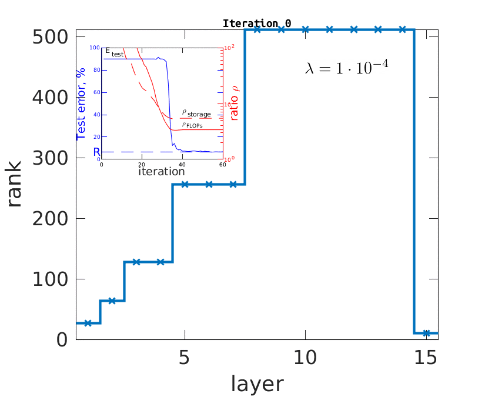
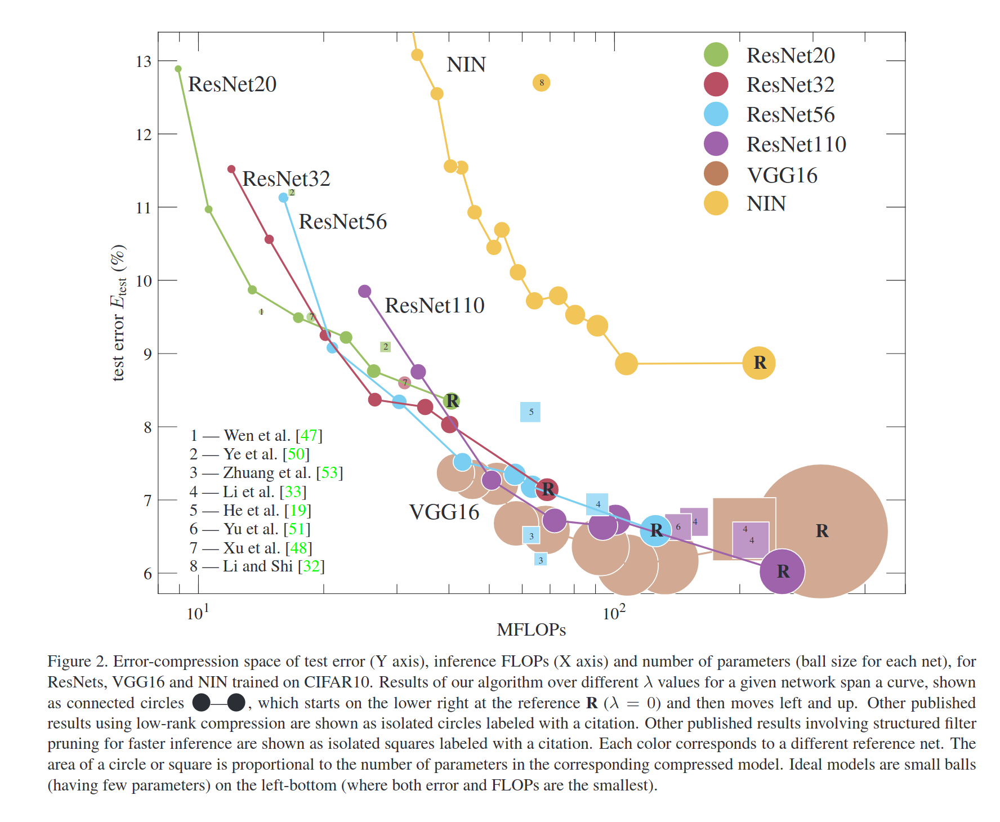

# Low-rank Compression of Neural Nets: Learning the Rank of Each Layer
This repository contains the code to fully reproduce the results of our CVPR2020 paper where we compress the neural networks with low-rank decompositions and automatically select the ranks to minimize loss and FLOPs jointly. 
In the animation below, we illustrate the rank selection process for VGG16 trained on CIFAR10:




## Installation
To use this code, you need to install the [main library](../../README.md) first.


## MNIST and CIFAR10 experiments
We provide the scripts to reproduce all results we are reporting in the paper: LeNet300 and LeNet5 on MNIST and VGG16, VGG19, NiN, and ResNets on CIFAR10. The following lines will run *all* experiments:
```bash
chmod +x run_lenet300.sh && ./run_lenet300.sh
chmod +x run_lenet5.sh && ./run_lenet5.sh
chmod +x run_resnets.sh && ./run_resnets.sh
chmod +x run_vggs.sh && ./run_vggs.sh
chmod +x run_nin.sh && ./run_nin.sh

``` 

Running all of the CIFAR10 experiments will take a lot of time. We recommend running selectively. 

The CIFAR10 experiments should produce the following trade-off figure (from paper):




## ImageNet experiments
We can achieve the following results on the AlexNet trained on the ImageNet dataset:

|                        |  MFLOPs  | top-1  |  top-5 | FLOPs reduction |
| -------------          |:--------:|--------|--------|-----------------|
|Caffe-AlexNet           |   724    | 42.70  | 19.80  | 1.00 |
|**ours, scheme 1**      |   240    | 42.83  | 19.93 | 3.01|
|**ours, scheme 2**      |   **151**    | 42.69  | 19.83 | **4.79**|

The scripts and pre-trained models for the ImageNet experiments are coming soon. 